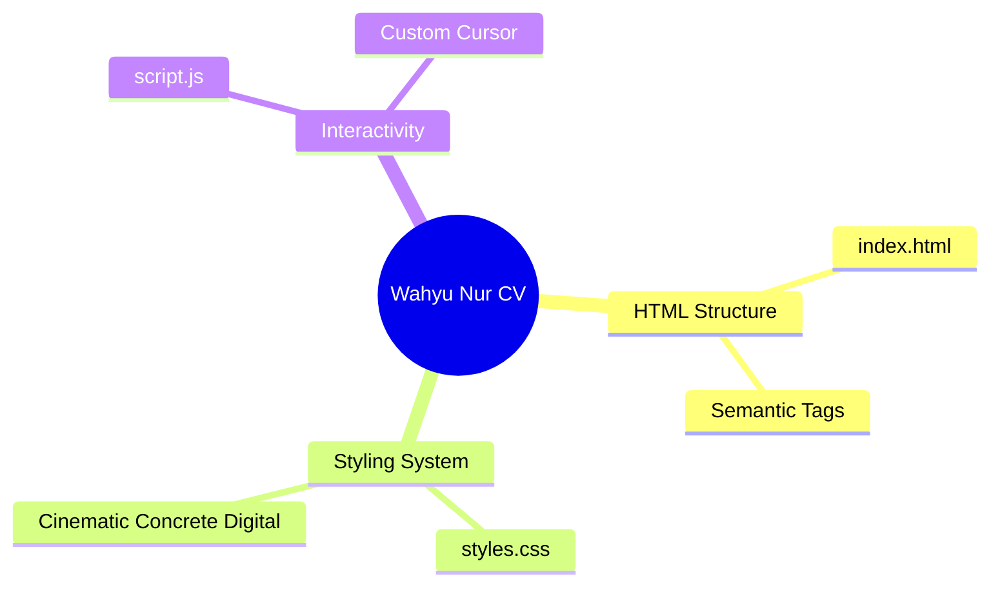

  
  
  <h1>👨‍💻 Wahyu Nur Iman</h1>
  <h3>Data Analyst & Automation Developer</h3>
  
  

    📍 Pondok Cabe, Tangerang Selatan | 📱 0881011322462 | ✉️ wahyunuriman999@gmail.com
  

  

    
    
    
    
  

  
  

    <i>Data Analyst yang berorientasi pada hasil dengan pengalaman dalam pengelolaan manpower, administrasi payroll, serta reporting dan monitoring project. Ahli dalam mengotomatisasi alur kerja menggunakan Apps Script, Python, VBA, dan LLM.</i>
  

## 💼 Pengalaman Kerja (CV)

### 🔥 Data Analyst - PT. Impact Power Mandiri (Staffinc Group)
*(September 2023 - Juni 2026)*

- Mengelola proses end-to-end manpower project, mulai dari hiring hingga deployment.
- Memimpin pelaksanaan product training dan training sistem (Appsheets, IDR & Istrike) untuk memastikan kesiapan operasional tim.
- Mengembangkan dan mengelola dashboard performa serta reporting (daily, weekly, monthly) sebagai dasar evaluasi dan pengambilan keputusan.
- Mengontrol administrasi payroll: rekap absensi, perhitungan gaji, pembuatan slip gaji, serta proses disbursement melalui Staffing Tools.
- Mengelola pengajuan Cash Advance (CA), reimbursement, dan request payment untuk mendukung kelancaran operasional project.
- Menyusun dan mengelola dokumen legal ketenagakerjaan (PKWT) serta administrasi BPJS Ketenagakerjaan & BPJS Kesehatan.
- Mengelola database manpower secara terstruktur untuk memastikan akurasi data dan kelengkapan administrasi.
- Melakukan koordinasi intensif dengan internal management, tim lapangan, dan klien untuk memastikan target project tercapai.
- Melakukan monitoring performa dan operasional project secara berkala.
- Mengelola administrasi invoicing dan memastikan kelengkapan dokumen penagihan kepada klien.
- Menyiapkan POSM dan produksi segala kebutuhan event & memonitor kelancaran event (Sebagai PIC event).
- **Tools Automation:** Membuat tools pribadi (Fuzzy Lookup & Similarity Matching Nama, Google Apps Script Automation, WEB cek rekening, LLM local menggunakan Api key & ollama & VBA Toolkit).
- **Project Handle:** Sinde, FKS Food, Shiseido, Diamond & Co, Beiersdorf, Skintific, Fumakilla NoMos, Greenfields, Otsuka Pocari, Kino, Garudafood.

### 🏥 Medical Record Staff - PT. MH Thamrin (Radjak Hospital) 
*(Feb 2022 - Ags 2023)*

- Mengelola administrasi pembuatan dan registrasi rekam medis pasien baru.
- Melakukan input dan update data pasien ke dalam sistem secara akurat dan tepat waktu.
- Menyiapkan dokumen pendukung seperti faktur dan surat kontrol pasien.
- Melakukan pelaporan status pasien kepada dokter dan tim medis untuk kebutuhan tindak lanjut pemeriksaan.
- Merekap dan mengelola data status rawat pasien secara terstruktur.
- Memastikan kelengkapan dan kerapihan dokumen rekam medis sesuai standar operasional rumah sakit.

---

## 🚀 Portofolio & Otomatisasi (Projects)

Berikut adalah *tools automation* dan sistem yang telah saya buat untuk mempermudah operasional perusahaan:

<table>
  <tr>
    <td width="50%">
      <h3>🤖 LLM Local & Vibe Coding</h3>
      
Mengintegrasikan AI lokal menggunakan API Key & Ollama untuk mempercepat analisis data dan otomatisasi respon, dikombinasikan dengan teknik Vibe Coding.

    </td>
    <td width="50%">
      <h3>🔍 Fuzzy Matching Toolkit</h3>
      
Tool cerdas (Fuzzy Lookup) untuk mendeteksi tingkat kemiripan data teks (Similarity Matching Nama) secara otomatis, mengurangi error administratif.

    </td>
  </tr>
  <tr>
    <td width="50%">
      <h3>⚡ Google Apps Script Automation</h3>
      
Sistem otomatisasi alur kerja berbasis cloud di ekosistem Google Workspace untuk pelaporan harian, rekapitulasi, dan manajemen data.

    </td>
    <td width="50%">
      <h3>🌐 WEB Cek Rekening</h3>
      
Pembuatan antarmuka web khusus untuk memverifikasi dan mengecek validitas nomor rekening secara real-time untuk kebutuhan payroll.

    </td>
  </tr>
</table>

---

## 📂 Repositori GitHub Saya

Kumpulan proyek dan sistem yang saya bangun di GitHub:

- 🛡️ **[AEGIS-ELITE](https://github.com/wahyunuriman999/AEGIS-ELITE)** - *Framework/Plugin sistem arsitektur AI.*
- 🧠 **[AEGIS-Core](https://github.com/wahyunuriman999/AEGIS-Core)** - *Cognitive runtime layer for AI engineering. Adds planning, memory hierarchy, and deterministic execution on top of any language model.*
- ⚙️ **[Ruhci-Claude-Engine](https://github.com/wahyunuriman999/Ruhci-Claude-Engine)** - *Deterministic Context Intelligence Engine for AI Coding Agents.*
- 🎨 **[Designer-Mind-Skill](https://github.com/wahyunuriman999/Designer-Mind-Skill)** - *Skill kustom untuk UI/UX design intelligence.*
- 📊 **[Auto-Create-Report](https://github.com/wahyunuriman999/Auto-Create-Report)** - *Otomatisasi pembuatan laporan.*
- 👨‍💻 **[ProgrammerMager](https://github.com/wahyunuriman999/ProgrammerMager)** - *AI Agent dengan persona software engineer kelas dunia.*

---

## 🛠️ Tech Stack & Keahlian

  
  
  
  
  
  
  
  

 

- **Sistem Perusahaan:** Appsheets, Istrike, IDR System, JotForm, Staffinc Tools, Cloudinary
- **Soft Skills:** Problem Solving, Komunikasi Klien, Adaptasi Tools Baru, Manajemen Data Sistematis

---

## 🎓 Pendidikan
- **SMK Negri 1 Rengel Tuban** — Teknik Sepeda Motor *(Juli 2017 – Mei 2020)*

---

<b>🗺️ Product Map (AEGIS Architecture)</b>

 

*(Generated via AEGIS Cognitive Runtime)*

