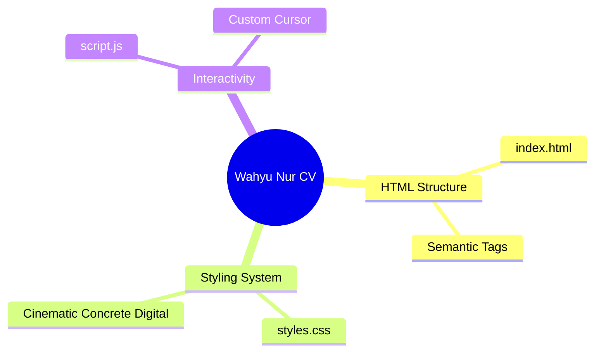

  
  
  <h1>👨‍💻 Wahyu Nur Iman</h1>
  <h3>Data Analyst & Automation Developer</h3>
  
  

    📍 Pondok Cabe, Tangerang Selatan | 📱 0881011322462 | ✉️ wahyunuriman999@gmail.com
  

  

    
    
    
  

  
  

    <i>Data Analyst yang berorientasi pada hasil dengan pengalaman dalam pengelolaan manpower, administrasi payroll, serta reporting dan monitoring project. Ahli dalam mengotomatisasi alur kerja menggunakan Apps Script, Python, VBA, dan LLM.</i>
  

## 💼 Pengalaman Kerja (CV)

<b>🔥 Data Analyst - PT. Impact Power Mandiri (Staffinc Group)</b> <i>(Sep 2023 - Juni 2026)</i>

 
<blockquote>
Mengelola proses end-to-end manpower project (hiring hingga deployment), memimpin product training (Appsheets, IDR & Istrike), dan mengembangkan dashboard reporting.
</blockquote>

- **Payroll & Admin**: Mengontrol payroll, rekap absensi, Cash Advance (CA), reimbursement, legal ketenagakerjaan (PKWT), serta BPJS.
- **Monitoring & Invoicing**: Memonitor operasional secara berkala, koordinasi intensif dengan klien, dan mengelola administrasi invoicing.
- **PIC Event**: Menyiapkan POSM dan memonitor kelancaran event.
- **Klien**: *Sinde, FKS Food, Shiseido, Diamond & Co, Beiersdorf, Skintific, Fumakilla NoMos, Greenfields, Otsuka Pocari, Kino, Garudafood.*

<b>🏥 Medical Record Staff - PT. MH Thamrin (Radjak Hospital)</b> <i>(Feb 2022 - Ags 2023)</i>

 

- Mengelola administrasi dan registrasi rekam medis pasien baru.
- Melakukan input dan update data pasien ke dalam sistem.
- Menyiapkan dokumen faktur dan surat kontrol pasien, serta melapor ke dokter.

---

## 🚀 Portofolio & Otomatisasi (Projects)

Berikut adalah beberapa *tools automation* dan sistem yang telah saya buat untuk mempermudah operasional perusahaan:

<table>
  <tr>
    <td width="50%">
      <h3>🤖 LLM Local & Vibe Coding</h3>
      
Mengintegrasikan AI lokal menggunakan API Key & Ollama untuk mempercepat analisis data dan otomatisasi respon, dikombinasikan dengan teknik Vibe Coding.

    </td>
    <td width="50%">
      <h3>🔍 Fuzzy Matching Toolkit</h3>
      
Tool cerdas (Fuzzy Lookup) untuk mendeteksi tingkat kemiripan data teks (Similarity Matching Nama) secara otomatis, mengurangi error administratif.

    </td>
  </tr>
  <tr>
    <td width="50%">
      <h3>⚡ Google Apps Script Automation</h3>
      
Sistem otomatisasi alur kerja berbasis cloud di ekosistem Google Workspace untuk pelaporan harian, rekapitulasi, dan manajemen data.

    </td>
    <td width="50%">
      <h3>🌐 WEB Cek Rekening</h3>
      
Pembuatan antarmuka web khusus untuk memverifikasi dan mengecek validitas nomor rekening secara real-time untuk kebutuhan payroll.

    </td>
  </tr>
</table>

---

## 🛠️ Tech Stack & Keahlian

  
  
  
  
  
  
  
  

 

- **Sistem Perusahaan:** Appsheets, Istrike, IDR System, JotForm, Staffinc Tools, Cloudinary
- **Soft Skills:** Problem Solving, Komunikasi Klien, Adaptasi Tools Baru, Manajemen Data Sistematis

---

## 🎓 Pendidikan
- **SMK Negri 1 Rengel Tuban** — Teknik Sepeda Motor *(2017 – 2020)*

---

  <h3>🌟 Interactive Web CV</h3>
  
Silakan buka file <code>index.html</code> pada repositori ini atau kunjungi <b>GitHub Pages</b> untuk melihat versi Web Interaktif Premium dari profil ini.

<b>🗺️ Product Map (AEGIS Architecture)</b>

 

*(Generated via AEGIS Cognitive Runtime)*

