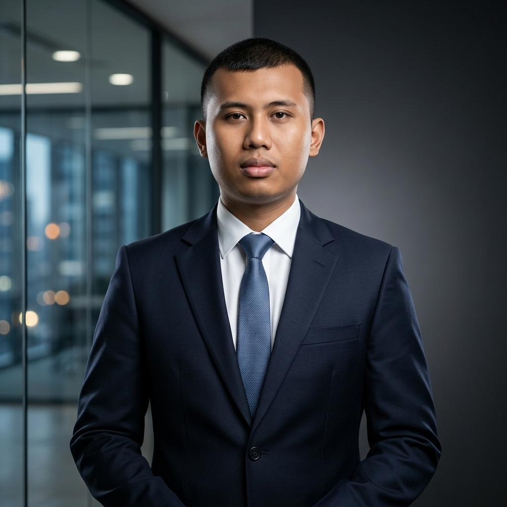
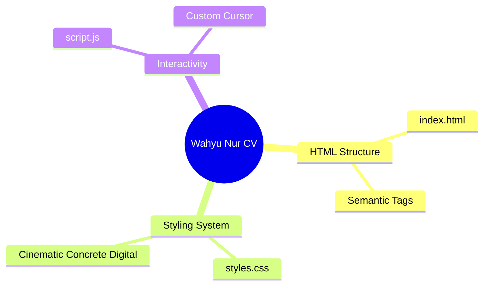

# 👨‍💻 Wahyu Nur Iman
**Data Analyst | Software Developer**

📍 Tuban / Tangerang Selatan | 📱 0881011322462 | ✉️ wahyunuriman999@gmail.com 
🔗 [LinkedIn](https://www.linkedin.com/in/wahyu-nur-iman-23425b210) | 🐙 [GitHub](https://github.com/wahyunuriman999) | 🌐 [Portfolio](https://bit.ly/PortofolioWahyuNurIman)

Data Analyst yang berorientasi pada hasil dengan pengalaman dalam pengelolaan manpower, administrasi payroll, serta reporting dan monitoring project. Berpengalaman dalam mengelola data secara sistematis, memastikan akurasi administrasi, serta mendukung operasional project secara end-to-end. Memiliki kemampuan analisis, koordinasi lintas tim, dan adaptif terhadap sistem kerja berbasis digital.

---

## 💼 Pengalaman Kerja

### Data Analyst - PT. Impact Power Mandiri (Staffinc Group)
*September 2023 - Juni 2026*
- Mengelola proses end-to-end manpower project, mulai dari hiring hingga deployment.
- Memimpin pelaksanaan product training dan training sistem (Appsheets, IDR & Istrike).
- Mengembangkan dan mengelola dashboard performa serta reporting (daily, weekly, monthly).
- Mengontrol administrasi payroll, cash advance (CA), reimbursement, dan request payment.
- Mengelola administrasi invoicing, dokumen legal (PKWT), serta BPJS.
- **Tools Automation:** Membuat tools pribadi (Fuzzy Lookup, Google Apps Script, LLM Local, VBA Toolkit).
- **Project Handled:** Sinde, FKS Food, Shiseido, Diamond & Co, Beiersdorf, Skintific, dll.

### Medical Record Staff - PT. MH Thamrin (Radjak Hospital)
*Februari 2022 - Agustus 2023*
- Mengelola administrasi pembuatan dan registrasi rekam medis pasien baru.
- Melakukan input dan update data pasien ke dalam sistem.
- Menyiapkan dokumen pendukung (faktur, surat kontrol) dan rekap status rawat pasien.

### Freelance Projects & Tech Initiatives
*2020 - 2021*
- Membuat Sistem Keamanan Rumah dengan Fingerprint berbasis IoT (Arduino & NodeMCU).
- Mendesain Mockup UI Sistem SIM, Perpustakaan, dan Manajemen Proyek IT.
- Partisipasi dalam Capture The Flag (CTF) Gemastik 2020.

---

## 🎓 Pendidikan & Organisasi

**Universitas Telkom (D3 Teknologi Komputer)** | *Agustus 2019 - Agustus 2022*
- Fokus perancangan sistem perangkat keras/lunak, jaringan, dan cloud.
- Ketua Komunitas Mahasiswa Tegal di Bandung.
- Wakil Ketua 2 MUBES D3TK 2020 & Pemateri Desain UI/UX D3TK 2021.

**SMK Negeri 1 Rengel Tuban (Teknik Sepeda Motor)** | *Juli 2017 - Mei 2020*

---

## 🛠️ Keahlian

- **Data & Automation:** Microsoft Excel (Advanced), Google Apps Script, Basic Python, VBA Toolkit, Vibe Coding, LLM Local.
- **Systems & Admin:** Appsheets, Istrike, IDR System, Staffinc Tools, JotForm, Cloudinary.
- **Engineering & Cloud:** Linux, Hardware Engineering, AWS, Azure, PowerShell, Github, IoT (Arduino).
- **Design & UI/UX:** UI/UX Design, HTML, CSS, CorelDraw, Photoshop.

---

## 🖥️ Interactive Web CV

Repositori ini juga memuat versi **Website Interaktif** dari CV saya. 
Untuk melihatnya secara online (jika sudah diaktifkan), kunjungi **[Link GitHub Pages Anda di sini]** atau cukup buka file `index.html` dari repositori ini.

<b>🗺️ Product Map (AEGIS Architecture)</b>

 

*(Generated via AEGIS Cognitive Runtime)*

