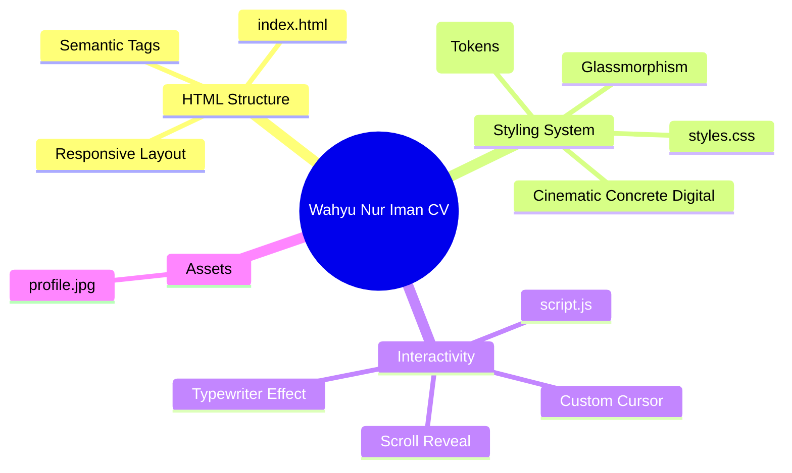

# Curriculum Vitae - Wahyu Nur Iman

Welcome to the interactive digital Curriculum Vitae for **Wahyu Nur Iman**, built with a **Cinematic Concrete Digital** design aesthetic.

This project is built using pure HTML, CSS, and JavaScript for maximum performance and easy deployability to GitHub Pages.

## ✨ Features
- **Cinematic Dark Theme**: Deep black backgrounds with teal/cyan accents and glassmorphism elements.
- **Interactive UI**: Custom cursor, typewriter effect, scroll-reveal animations, and floating elements.
- **Responsive Design**: Works perfectly across desktop, tablet, and mobile devices.
- **Image Enhancement**: The profile image is styled via CSS to look cinematic (enhanced contrast, subtle grayscale) and becomes vibrant on hover.

## 🚀 Setup & Deployment

1. **Add your photo**: Place your profile picture in this repository and name it `profile.jpg`.
2. **Local viewing**: Simply open `index.html` in any web browser.
3. **Deployment**: Enable GitHub Pages in your repository settings and point it to the `main` branch.

## 🗺️ Product Map (AEGIS Architecture)

---
*Generated and architected via AEGIS Cognitive Runtime.*
