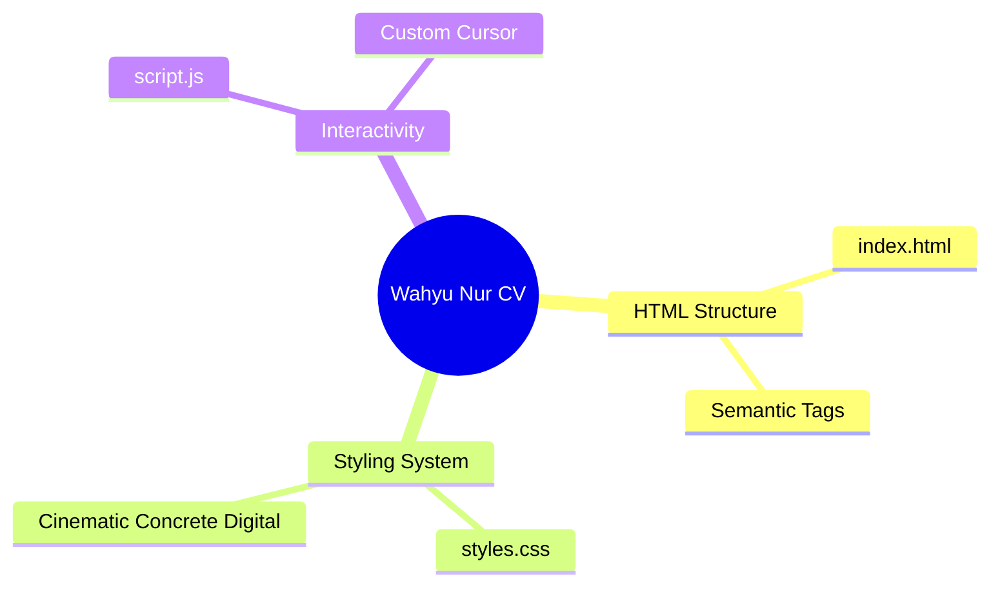

# 👨‍💻 Wahyu Nur Iman
**Data Analyst**

📍 Pondok Cabe, Tangerang Selatan (Asal: Tuban, 01 Agustus 2001) | 📱 0881011322462 | ✉️ wahyunuriman999@gmail.com 
🔗 [Portfolio](https://bit.ly/PortofolioWahyuNurIman)

Data Analyst yang berorientasi pada hasil dengan pengalaman dalam pengelolaan manpower, administrasi payroll, serta reporting dan monitoring project. Berpengalaman dalam mengelola data secara sistematis, memastikan akurasi administrasi, serta mendukung operasional project secara end-to-end. Memiliki kemampuan analisis, koordinasi lintas tim, dan adaptif terhadap sistem kerja berbasis digital. Berkomitmen untuk memberikan kontribusi maksimal dalam meningkatkan efisiensi operasional dan kualitas administrasi perusahaan.

---

## 💼 Pengalaman Kerja

### Data Analyst - PT. Impact Power Mandiri (Staffinc Group)
*September 2023 - Juni 2026*
- Mengelola proses end-to-end manpower project, mulai dari hiring hingga deployment.
- Memimpin pelaksanaan product training dan training sistem (Appsheets, IDR & Istrike) untuk memastikan kesiapan operasional tim.
- Mengembangkan dan mengelola dashboard performa serta reporting (daily, weekly, monthly) sebagai dasar evaluasi dan pengambilan keputusan.
- Mengontrol administrasi payroll: rekap absensi, perhitungan gaji, pembuatan slip gaji, serta proses disbursement melalui Staffing Tools.
- Mengelola pengajuan Cash Advance (CA), reimbursement, dan request payment untuk mendukung kelancaran operasional project.
- Menyusun dan mengelola dokumen legal ketenagakerjaan (PKWT) serta administrasi BPJS Ketenagakerjaan & BPJS Kesehatan.
- Mengelola database manpower secara terstruktur untuk memastikan akurasi data dan kelengkapan administrasi.
- Melakukan koordinasi intensif dengan internal management, tim lapangan, dan klien untuk memastikan target project tercapai.
- Melakukan monitoring performa dan operasional project secara berkala.
- Mengelola administrasi invoicing dan memastikan kelengkapan dokumen penagihan kepada klien.
- Menyiapkan POSM dan produksi segala kebutuhan event & memonitor kelancaran event (Sebagai PIC event).
- **Tools Automation:** Membuat tools pribadi untuk mempermudah pekerjaan (Fuzzy Lookup & Similarity Matching Nama (Fuzzy Matching), Google Apps Script Automation, WEB cek rekening, LLM local (Ai local menggunakan Api key & ollama) & VBA Toolkit).
- **Project Handle:** Sinde, FKS Food, Shiseido, Diamond & Co, Beiersdorf, Skintific, Fumakilla NoMos, Greenfields, Otsuka Pocari, Kino, Garudafood.

### Medical Record Staff - PT. MH Thamrin (Radjak Hospital)
*Februari 2022 - Agustus 2023*
- Mengelola administrasi pembuatan dan registrasi rekam medis pasien baru.
- Melakukan input dan update data pasien ke dalam sistem secara akurat dan tepat waktu.
- Menyiapkan dokumen pendukung seperti faktur dan surat kontrol pasien.
- Melakukan pelaporan status pasien kepada dokter dan tim medis untuk kebutuhan tindak lanjut pemeriksaan.
- Merekap dan mengelola data status rawat pasien secara terstruktur.
- Memastikan kelengkapan dan kerapihan dokumen rekam medis sesuai standar operasional rumah sakit.

---

## 🎓 Pendidikan

**SMK Negri 1 Rengel Tuban** | *Juli 2017 – Mei 2020*
- Jurusan: Teknik Sepeda Motor

---

## 🛠️ Keahlian

### Hard Skill
Microsoft Excel, Word, PowerPoint, Appsheets, Istrike, IDR System, App Script, JotForm, Staffinc Tools & Staffinc Suite, Basic Python, Cloudinary, PowerShell, HTML, VBA, Vibe Coding, Github & CMD

### Soft Skill
Administrasi dan pengelolaan data yang rapi dan sistematis, Analisis data dasar dan problem solving, Komunikasi yang baik dengan tim dan stakeholder, Cepat beradaptasi dengan sistem dan tools baru, Mampu bekerja secara detail dan teliti

### Bahasa
- **Indonesia:** Fasih
- **Inggris:** Pasif

---

## 🖥️ Interactive Web CV

Repositori ini juga memuat versi **Website Interaktif** dari CV saya. 
Untuk melihatnya secara online (jika sudah diaktifkan), kunjungi **[Link GitHub Pages Anda di sini]** atau cukup buka file `index.html` dari repositori ini.

<b>🗺️ Product Map (AEGIS Architecture)</b>

 

*(Generated via AEGIS Cognitive Runtime)*

